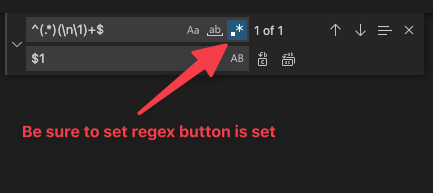
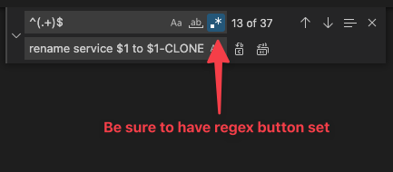

# Visual Studio Code RegEx Search Patterns

These are a few regex patterns to help with search and replace. 

## Remove duplicated/repeating lines in a file

The search pattern will search for everyline that has duplicates, and the replace pattern will remove all the duplicate lines except for the original.

```
# Search Pattern
^(.*)(\n\1)+$

# Replace Pattern
$1

```



## Modify Every Line

This search pattern searches for every line, and the replace pattern allow you to modify the line. In this example, I'm taking the name of a firewall service object, adding "rename service" to the front of the object name and adding "to (object name)-CLONE"; e.g., "tcp-80" turns into "rename service tcp-80 to tcp-80-CLONE". 

```
# Search Pattern
^(.+)$

# Replace Pattern
rename service $1 to $1-CLONE

```

