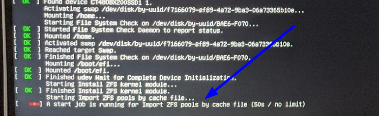

# Ubuntu 20.04 ZFS Notes

## Boot Issues

For unknown reasons, system appears to be stall at boot. 

**Solution**

If this happens, boot to single-user mode and disable zfs-import services:

    systemctl disable zfs-import-scan
    systemctl disable zfs-import-cache

This should get the system back up. Once it's up, verify zfs pool is there:

    zfs import

Then disable some zfs services:

    echo "0" > /sys/module/zfs/parameters/spa_load_verify_metadata
    echo "0" > /sys/module/zfs/parameters/spa_load_verify_data

Then import the pool

    zfs import (poolname)
